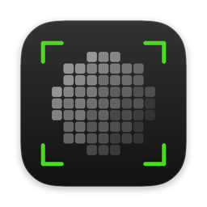

<p align="center">
  
</p>

<h1 align="center">Blurry</h1>

<p align="center">
  Copre i volti e cancella i metadati di foto e video,<br>
  sul tuo computer e senza rete.
</p>

<p align="center">
  <a href="https://github.com/Chrono-Web/BLURRY/releases/latest/download/Blurry.dmg"><b>⬇ Scarica per Mac</b></a>
  &nbsp;·&nbsp;
  <a href="https://github.com/Chrono-Web/BLURRY/releases/download/v0.1.2/Blurry-0.1.2-windows-x64-setup.exe"><b>⬇ Scarica per Windows</b></a>
  &nbsp;·&nbsp;
  <a href="https://github.com/Chrono-Web/BLURRY/releases/download/v0.1.2/Blurry-0.1.2-linux-x86_64.tar.gz"><b>⬇ Scarica per Linux</b></a>
  <br>
  <sub>Mac (Apple Silicon, macOS 14+) · Windows 11 e Ubuntu 24.04 (x64) · versione 0.1.2 · gratuito e open source (MIT)</sub>
  <br>
  <sub><a href="README.md">English</a> · <a href="THREAT_MODEL.it.md">Modello delle minacce</a> · <a href="SECURITY.md">Sicurezza</a></sub>
</p>

Blurry trova i volti, li copre con un rettangolo nero (o con la pixelazione) e scrive un file nuovo
senza metadati: niente posizione GPS, niente modello della fotocamera, niente date, niente
miniatura nascosta dell'originale. Funziona tutto senza rete: niente server, account, telemetria o
controllo degli aggiornamenti, e rifiuta di aprire connessioni anche se qualcosa ci prova.

> **Guarda sempre il risultato prima di condividerlo:** il rilevatore può mancare dei volti, e
> Blurry non nasconde corpi, voci o luoghi. Vedi [Che cosa non fa](#che-cosa-non-fa).

## Installare

### Mac

Apple Silicon (M1 o successivi), macOS 14 o successivo.

1. Scarica [`Blurry.dmg`](https://github.com/Chrono-Web/BLURRY/releases/latest/download/Blurry.dmg)
   dalla pagina delle [Release](https://github.com/Chrono-Web/BLURRY/releases).
2. Aprilo e trascina Blurry sulla cartella Applicazioni.
3. La prima volta macOS avvisa che non può verificare lo sviluppatore: Blurry non è firmato da
   Apple. Apri Impostazioni di Sistema › Privacy e sicurezza, scorri in fondo e premi **Apri
   comunque** accanto a Blurry. Serve una volta sola.

### Windows e Linux

I pacchetti pronti si scaricano dalla
[release v0.1.2](https://github.com/Chrono-Web/BLURRY/releases/tag/v0.1.2).

- **Windows 11 x64:** `Blurry-0.1.2-windows-x64-setup.exe`. Aprilo: installa solo per il tuo
  utente, senza amministratore. Blurry non è firmato, quindi la prima volta SmartScreen avvisa:
  scegli **Ulteriori informazioni › Esegui comunque**.
- **Ubuntu 24.04 x86-64:** `Blurry-0.1.2-linux-x86_64.tar.gz`. Estrailo e lancia
  `sh install.sh` dentro la cartella `Blurry-linux`.

Python, Qt e il modello sono inclusi. Provato su un desktop Windows 11 reale;
su Linux per ora solo in CI. Controlla ogni risultato prima di condividerlo e segnala i problemi nelle
[Issues](https://github.com/Chrono-Web/BLURRY/issues). Librerie di sistema, disinstallazione e
verifiche ancora aperte sono in [Distribuzione desktop](docs/DISTRIBUZIONE.md).

### Con Python (motore, server, container, CLI e Qt facoltativa)

Serve Python 3.12. Il modo più semplice è [pipx](https://pipx.pypa.io/) (oppure `uv tool`). Con
l'app:

```bash
pipx install "blurry-opsec[gui]"
```

Solo il comando da terminale:

```bash
pipx install blurry-opsec
```

## L'app

L'app funziona allo stesso modo **su Mac** (`Blurry.dmg`) e **su Windows e Linux** (gli
installatori qui sopra; con il pacchetto Python lancia `blurry` senza argomenti, oppure
`blurry-app`). Le scorciatoie usano ⌘ su Mac e Ctrl altrove.

1. **Trascina** foto e video nella finestra, oppure usa *Scegli file…* (⌘O / Ctrl+O).
2. Una **guida** prende un file alla volta: il file al centro e sotto una scelta alla volta
   (sensibilità, copertura, margine e, per i video, l'audio). Dalla copertura in poi l'immagine
   mostra esattamente quello che verrà esportato; in un video puoi riprodurre il risultato coperto.
3. **Correggi i riquadri** a mano se serve: nelle foto disegna, sposta, ridimensiona o togli i
   riquadri; nei video spegni una traccia che non è un volto, o disegna un riquadro fermo su un
   intervallo di tempo.
4. **Esporta…** chiede dove salvare, partendo dalla cartella dell'originale, con
   `<nome>_blurry`. L'originale non viene mai toccato. Se non ha trovato volti, Blurry chiede prima.

Tutti i file della sessione sono in Vista › Coda (⌘L / Ctrl+L). Al primo avvio un'introduzione
spiega come lavorare e i limiti del rilevatore; poi i suggerimenti accompagnano il primo file.
Puoi rivederla da Aiuto › Rivedi la guida oppure dalle Impostazioni.

Le **Impostazioni** (Blurry › Impostazioni… ⌘, su Mac; File › Impostazioni… Ctrl+, altrove)
hanno sensibilità, copertura e margine, con il ripristino dei valori consigliati. Le scelte si
applicano anche al file aperto. Da qui trovi anche la guida, la versione installata, le Release
per aggiornare a mano e la disinstallazione; su Windows e Linux anche la lingua.

Blurry ricorda solo poche impostazioni (sensibilità, copertura, margine, lingua e se la guida è
già stata vista): mai nomi di file, cartelle o file recenti. Su Windows e Linux usa selettori di
file suoi, perché i dialoghi del sistema e di Qt tengono un elenco delle cartelle recenti; l'app
per Mac usa i pannelli del sistema e toglie quello che registrano appena si chiudono.

## Che cosa fa

- **Copre i volti** in foto e video, con il rilevatore YuNet (incluso; il suo SHA-256 si controlla
  a ogni avvio, e se non corrisponde Blurry non parte).
- **Toglie tutti i metadati**:
  - foto: EXIF (compresa la miniatura incorporata), GPS, XMP, IPTC, profili colore e commenti;
  - video: tag del contenitore e delle tracce (luogo QuickTime, dispositivo, date), capitoli,
    sottotitoli, tracce dati (come il GPS di GoPro e droni) e copertine.
- **Applica prima la rotazione** di foto e video del telefono ai pixel, così i volti di lato non
  sfuggono, e il risultato si vede come prima senza portarsi dietro i metadati di rotazione.
- **Toglie l'audio di default**, perché le voci possono identificare. Per tenerlo: `--keep-audio`.
- **Non sovrascrive mai niente**: l'originale resta intatto, e se il nome di uscita è già preso
  ne usa uno numerato.
- **Non tace mai se non trova volti**: avvisa, e con `--strict` non scrive niente ed esce con
  codice 2.

## Che cosa non fa

Leggi il [modello delle minacce](THREAT_MODEL.it.md) prima di fidarti di Blurry. In breve, **non**
nasconde corpi, vestiti, tatuaggi, voci, luoghi, riflessi né l'impronta del sensore della
fotocamera; non può coprire un volto che il rilevatore non trova; non cancella l'originale, che può
essere sincronizzato anche su iCloud o Google Foto.

**Il rilevatore può mancare dei volti**, soprattutto di profilo, al buio, molto piccoli o girati di
lato. Guarda sempre il risultato prima di condividerlo. I file con rilevamenti incerti sono elencati
sotto `flags` nel resoconto `--json`.

## Disinstallare

**Mac:** apri Blurry › Impostazioni… › Disinstalla e premi **Disinstalla Blurry…**.
Dopo la conferma, l'app si sposta nel Cestino e le preferenze vengono cancellate.
Foto, video ed esportazioni restano dove sono. Reinstallando l'app, l'onboarding riparte da zero.

Puoi anche chiudere Blurry e trascinarla da Applicazioni al Cestino. In questo caso le preferenze
restano: per azzerarle, con l'app chiusa esegui `defaults delete com.chronocol.blurry` nel Terminale.

**Windows e Linux:** Impostazioni → Disinstalla; Windows offre anche la rimozione
dalle App di sistema, Linux lo script `~/.local/opt/blurry/uninstall.sh` con app chiusa.
La rimozione completa elimina le preferenze e riavvia la guida alla reinstallazione.
Vedi [distribuzione](docs/DISTRIBUZIONE.md).

**Con Python:** `pipx uninstall blurry-opsec`. Per azzerare anche le preferenze dell'app usa
prima Impostazioni → Disinstalla → Cancella le impostazioni e chiudi.

## Segnalare un problema

Qualcosa non funziona, o un volto non viene coperto? Apri una
[issue](https://github.com/Chrono-Web/BLURRY/issues/new): descrivi che cosa hai fatto e che cosa
è successo, **senza allegare foto o video di persone reali**. Le vulnerabilità di sicurezza invece
non vanno nelle issue pubbliche: segui [SECURITY.md](SECURITY.md).

Con degli argomenti, `blurry` resta un comando: nessuna finestra, anche con `[gui]` installato.

## Dal terminale

```bash
blurry foto.jpg
```

scrive `foto.blurry.jpg` accanto all'originale.

```bash
blurry IMG_0001.HEIC clip.mov -o ~/Desktop/puliti
```

scrive `IMG_0001.blurry.jpg` e `clip.blurry.mp4` in `~/Desktop/puliti`.

```
blurry INPUT... [-o CARTELLA] [--level base|medium|high] [--mode solid|pixel]
    [--padding 0.25] [--keep-audio] [--no-faces] [--watermark TESTO]
    [--strict] [--json] [--debug]
```

| Opzione | Significato | Default |
|---|---|---|
| `-o CARTELLA` | Dove scrivere i file | accanto a ogni originale |
| `--level` | Sensibilità: `base` (solo volti evidenti e frontali), `medium`, `high` (anche volti piccoli o in parte nascosti) | `high` |
| `--mode` | Rettangolo nero `solid` o pixelazione `pixel` | `solid` |
| `--padding` | Margine attorno a ogni volto, in frazione del lato lungo, per ogni lato | `0.25` |
| `--keep-audio` | Tiene la traccia audio (ricodificata in AAC) | audio tolto |
| `--no-faces` | Toglie solo i metadati, non copre niente | |
| `--watermark TESTO` | Aggiunge una filigrana di testo | spenta |
| `--strict` | Se un file non ha volti, non scrive niente ed esce con codice 2 | |
| `--json` | Stampa su stdout un resoconto JSON per ogni file | |
| `--debug` | Messaggi di debug su stderr | spento |

**File accettati.** Foto: JPEG, PNG, WebP (statico), HEIC/HEIF. Video: MP4, MOV, M4V, MKV, WebM,
AVI. GIF e immagini animate si rifiutano. Le foto escono in JPEG (il PNG resta PNG); i video in
MP4 (H.264).

**Codici di uscita.** `0` tutto bene · `1` un errore · `2` nessun volto con `--strict`.

L'avanzamento va su stderr come righe `__PROGRESS__ {json}`, per script e integrazioni.

Per processi backend, server e pipeline, il [contratto CLI](docs/CLI_CONTRACT.md)
definisce JSON Lines, progressi e codici di uscita, compresi errori globali e batch
strict. L’esempio Node [backend-process.mjs](examples/backend-process.mjs) usa il
processo separato; nessuna integrazione nelle repo Chrono è stata modificata.

## Verificare quello che scarichi

Ogni release su GitHub ha un file `SHA256SUMS`, un SBOM CycloneDX e un'attestazione GitHub di
provenienza per ogni file, che dimostra che è stato costruito dal workflow di rilascio di questa
repository.

- macOS / Linux, nella cartella dei file scaricati:

  ```bash
  shasum -a 256 -c SHA256SUMS
  ```

- Windows (confronta il risultato con la riga in `SHA256SUMS`):

  ```
  CertUtil -hashfile <file> SHA256
  ```

- Provenienza, con la [GitHub CLI](https://cli.github.com/):

  ```bash
  gh attestation verify <file> --repo Chrono-Web/BLURRY
  ```

Il pacchetto su PyPI si pubblica dallo stesso workflow con Trusted Publishing (senza token), e PyPI
ne mostra la provenienza nella pagina del progetto.

## Limiti noti

- Volti di profilo, al buio, molto piccoli o girati di lato possono sfuggire (vedi sopra).
- I video HDR del telefono (HEVC a 10 bit) escono in H.264 SDR a 8 bit: i colori possono sembrare
  più spenti.
- Su macOS, elaborando un video compare un avviso innocuo `objc ... implemented in both`, perché
  OpenCV e PyAV portano ciascuno la propria copia di FFmpeg.

## Licenza

Blurry ha licenza MIT. Il pacchetto su PyPI contiene solo il codice di Blurry, il modello YuNet
(MIT) e il font Geist (OFL). Gli installer desktop contengono anche le dipendenze e FFmpeg con **x264 e x265,
che sono GPL-2.0-or-later**, e il bootloader di PyInstaller (GPL-2.0 con un'eccezione per i
programmi che avvia): in [THIRD_PARTY_LICENSES.md](THIRD_PARTY_LICENSES.md) trovi tutte le
licenze e i sorgenti esatti.
